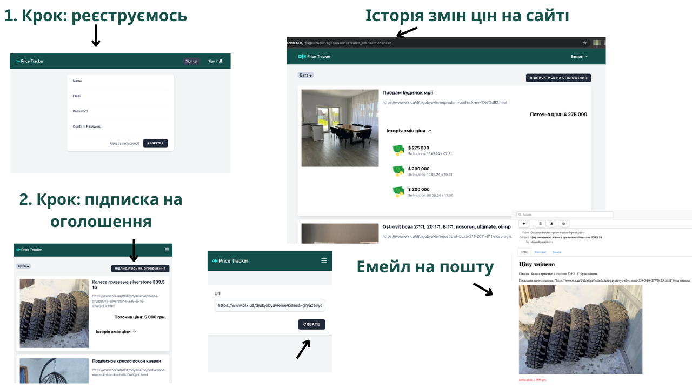
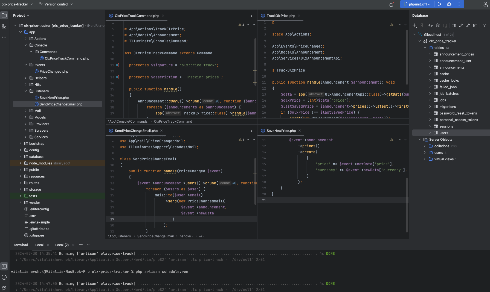

<h1 align="center" style="color: dodgerblue">Olx price tracker (Laravel 11 / VueJs 3 / REST API)</h1>

## 🔵 Про проєкт

- При підписці на оголошення Olx, введений url валідується і парситься його Olx ID. 
- Маючи Olx ID оголошення і проаналізувавши трафік сайту Olx, потрібну інформацію про оголошення дістаємо через API.
- Розроблено консольну 'artisan olx:price-track', яка обходить всі оголошення кожні 5 хвилин і через АПІ перевіряє чи ціну змінено. Якщо змінено кидає івент.
- Ліснери слухають подію і зберігають нову ціну в базу та відсилають емейл користувачу.

## 🔵 Схема роботи

